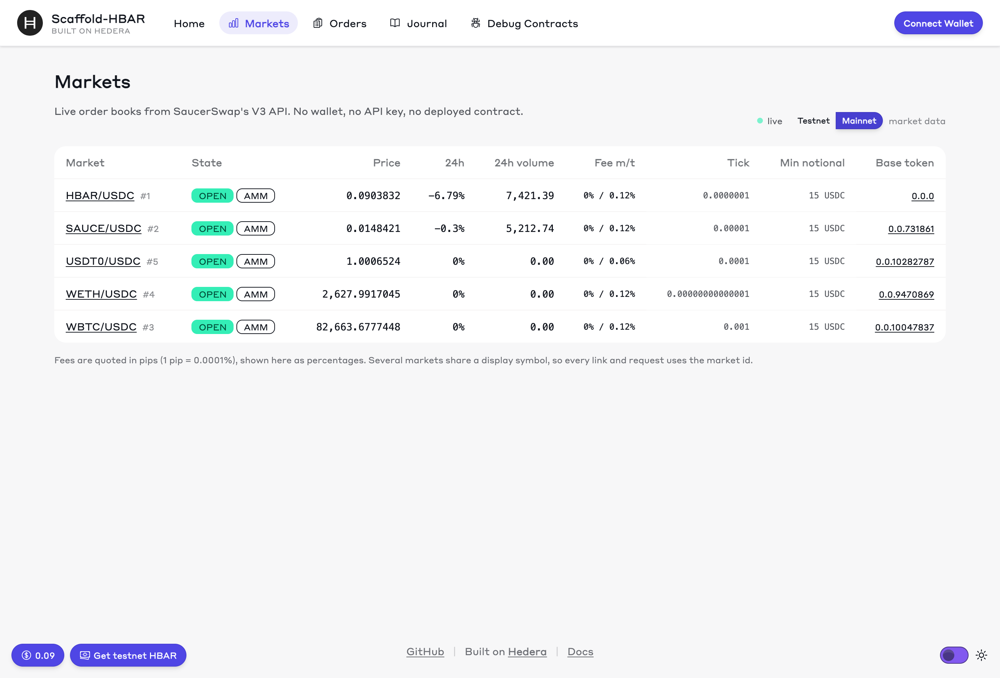
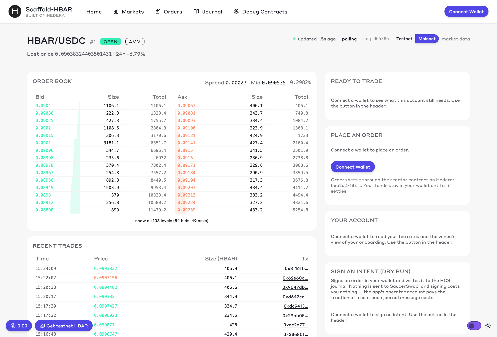
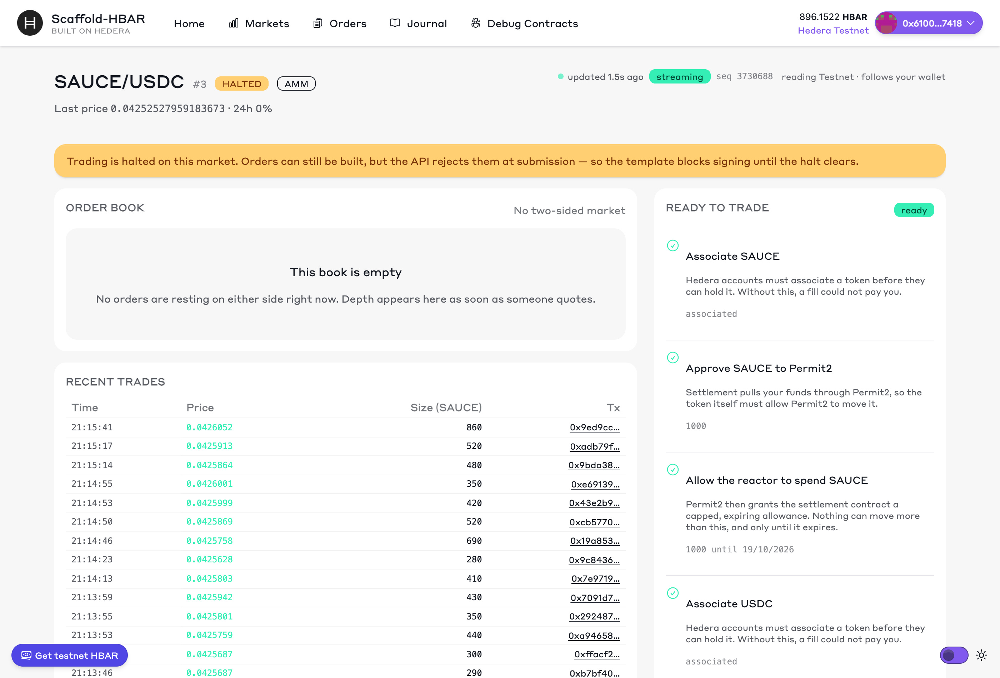
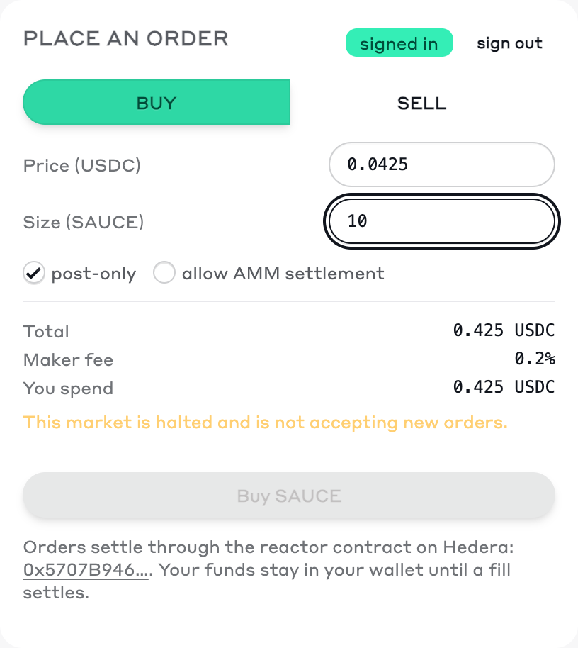
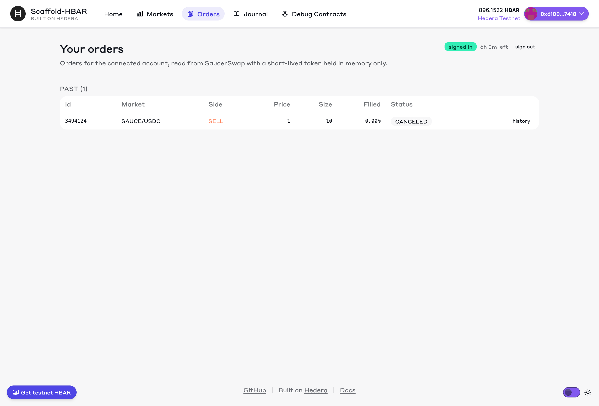
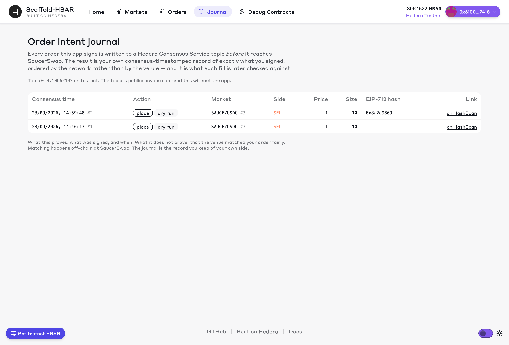
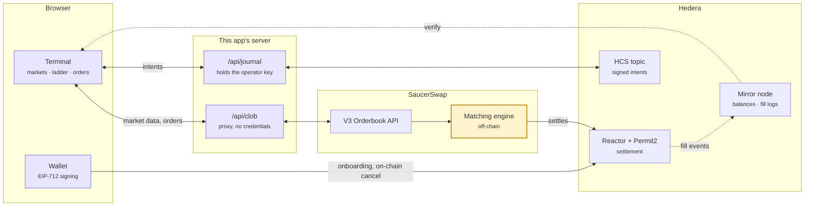
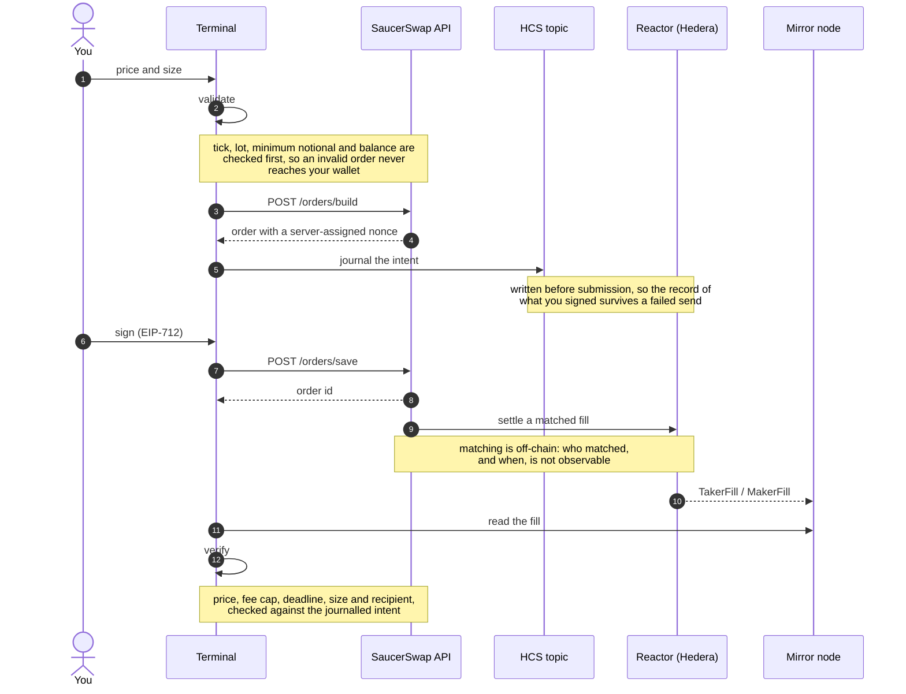

# limit-orders — the reference client for SaucerSwap's V3 order book on Hedera

Add non-custodial limit orders from SaucerSwap's order book to any Hedera app, with every fill verified
on-chain against what you signed.

```bash
npm create scaffold-hbar@latest --template OrderForge/scaffold-hbar-limit-orders
```

> **Status:** complete and working — market terminal, live depth over WebSocket, onboarding, wallet
> login, order placement and cancellation, the HCS journal, and on-chain fill verification.
>
> **Disclaimer:** this template is **experimental** and **not audited**. It places orders against a
> third-party venue and defaults to Hedera **testnet**. Read SaucerSwap's
> [Risk Notice](https://docs.saucerswap.finance/legal/orderbook-risk-notice) and
> [Terms](https://docs.saucerswap.finance/legal/terms-of-service) before trading real funds.



<p align="center"><em>Live mainnet markets. No wallet, no API key, no deployed contract.</em></p>

## Contents

1. [Run it in 60 seconds](#run-it-in-60-seconds) — no keys, no wallet
2. [What you get](#what-you-get) — and what you still trust the venue for
3. [What you could build with it](#what-you-could-build-with-it) — six starting points
4. [See it working](#see-it-working) — the wallet half, in pictures
5. [How it works](#how-it-works) — architecture, the order path, where each piece lives
6. [Set up the on-chain half](#set-up-the-on-chain-half) — keys, journal topic, test tokens
7. [Configuration](#configuration) — [modes](#modes), networks, environment
8. [Reference](#reference) — commands, layout, wallet setup, units
9. [Documentation](#documentation) — the four guides, and which to read first
10. [What this does not do](#what-this-does-not-do)
11. [Troubleshooting](#troubleshooting)

## Run it in 60 seconds

```bash
yarn install
yarn next:dev
```

Open <http://localhost:3000/markets>. Market discovery, depth, the trade tape and quotes are **public**
endpoints: no wallet, no API key, no deployed contract.

Testnet markets are thin and often halted, so the terminal has a **Testnet / Mainnet** toggle for market
data. Reading mainnet prices moves no funds; wallet actions stay on your wallet's own network.



<p align="center"><em>HBAR/USDC on mainnet: 103 levels of real depth, the spread, and a trade tape linked
to settlement transactions.</em></p>

> **Why requests go through this app's own `/api/clob` route:** the Orderbook API sends no CORS headers,
> so a browser cannot call it directly however public the endpoint is — it is built for server-side
> clients. The app forwards the request from its server instead. The proxy holds no credentials. See
> [docs/DISCREPANCIES.md](docs/DISCREPANCIES.md).

## What you get

SaucerSwap runs a central limit order book (V3) on Hedera, separate from its AMM pools. It has a public
HTTP API and **no published client library**. This template is that client, plus a working UI on top of it.

- **Market data** — books, depth, the trade tape and quotes, with each market's trading rules (tick, size
  step, lot, minimum notional) applied correctly.
- **Live depth** — the WebSocket with snapshot-and-diff reconciliation, re-syncing on any gap, falling
  back to polling when it cannot connect.
- **Onboarding** — before it can trade, a Hedera account must associate the tokens (HTS), approve them
  to Permit2, and approve the reactor inside Permit2. The template detects each step, does it in one
  click, and re-checks the result against the chain rather than trusting the receipt.
- **Account** — wallet-challenge login, your own fee rates, your orders and their history. The token is
  short-lived and held in memory only: never localStorage, never a cookie, never logged.
- **Orders** — build, sign (EIP-712) and submit; cancel through the API or directly on-chain.
- **Journal** — every signed intent goes to an HCS topic before submission, giving you your own
  consensus-timestamped record of what you signed.
- **Verification** — every fill is verified on-chain against the order you signed: price, fee cap,
  deadline, size and recipient. See [docs/hedera.md](docs/hedera.md).

### What you still trust SaucerSwap for

Matching happens off-chain, and only SaucerSwap's filler can settle your order, so the venue decides the
order in which orders match and whether your order is accepted at all. What the contract does guarantee is
that no fill can break the terms you signed, and that you can cancel on-chain without asking anyone. This
template verifies the second part and is explicit about the first.

## What you could build with it

A limit order is a primitive, not a product. The parts worth reusing are the typed client,
the money handling, the six onboarding steps and the verification — each of these starts
from something already here rather than from the API documentation.

| Idea | What you start from |
| --- | --- |
| **A limit-order button in an app that already swaps.** Offer "set a price instead" next to a market swap, so a user who does not like the current rate leaves an order behind instead of leaving. | `components/clob/OrderEntry.tsx` and `lib/clob/orders.ts` — the whole build → journal → sign → submit path |
| **Laddering or DCA.** Split one large order into a grid of smaller ones across a price range, or buy a fixed amount on a schedule. | The same placement path in a loop; `validateOrder` already enforces the tick, lot and minimum-notional rules each rung has to satisfy |
| **A post-only market maker.** Quote both sides, never cross, and earn the maker fee rather than pay the taker one. | `makerOnly` is a per-order flag, and `lib/clob/format.ts` converts the fee pips honestly; `lib/clob/depthStream.ts` gives a book that is current and knows when it is not |
| **Treasury or DAO exits.** Sell a position at a target price over time, without handing custody to anyone — the allowance the checklist sets is capped and expires. | `lib/hedera/onboarding.ts` for the allowances, `lib/verify/fills.ts` for the record of what actually settled |
| **An agent that trades for you.** An automated signer can commit to an order and leave a consensus-timestamped record of exactly what it committed to, which is a different thing from its own logs. | `lib/journal/` writes the intent before submission; the digest in each record links it to the settlement that follows |
| **Alerting and receipts.** Watch a book for a price or a depth change, or produce a record of intent against settlement for accounting. | `lib/clob/depthStream.ts` for the book, `lib/mirror/` for the chain, `lib/verify/fills.ts` for the comparison |

None of these needs a contract deployed. The venue's contracts are already on Hedera; this
template is the client that talks to them correctly.

## See it working

Connect a wallet and the app follows **its** network, because an approval signed on one chain says
nothing about the other. The readiness checklist is derived from the chain — the mirror node and the
contracts — rather than from the venue's view of your account.



<p align="center"><em>Signed in: depth switches from polling to the WebSocket, and the six on-chain
onboarding steps are checked against the chain. This market is halted, which the page says plainly
rather than hiding.</em></p>

The order ticket validates before it asks your wallet for anything: an off-tick price, a size
that is not a whole lot, or an order below the minimum notional is named and refused here
rather than rejected by the venue after you have signed it.

<p align="center">
  
</p>

<p align="center"><em>Buy or sell, post-only to guarantee the maker fee, and AMM settlement opt-in
per order. The total and the fee are shown before signing — including on a halted market, where the
order cannot be placed but the arithmetic still answers "what would this cost?".</em></p>

Signing in exchanges a wallet signature for a short-lived API token, which never leaves memory.



<p align="center"><em>Your orders, read from SaucerSwap with a token held in memory only. Every fill is
checked against the order you signed.</em></p>



<p align="center"><em>Each signed intent, on an HCS topic, ordered by consensus rather than by the venue.
The digest is what links an intent to the settlement that follows.</em></p>

These frames are scripted — `yarn clob:shots` re-captures them from the running app — so they cannot
quietly drift from what the code does.

## How it works



The highlighted box is the one part nobody can verify: matching happens off-chain, and only
SaucerSwap's filler can settle an order. Everything else is in your browser, on your own
server, or on Hedera where anyone can check it.

<details>
<summary><strong>Placing an order, end to end</strong> — the full sequence</summary>



See [docs/hedera.md](docs/hedera.md#the-trust-boundary) for what each guarantee rests on.

</details>

| Piece | Where |
| --- | --- |
| Typed API client | `packages/nextjs/lib/clob/` |
| Same-origin API proxy | `packages/nextjs/app/api/clob/[network]/[...path]` |
| Mirror node reads | `packages/nextjs/lib/mirror/` |
| Wallet login | `packages/nextjs/lib/clob/auth.ts` — token in memory only |
| Onboarding checks | `packages/nextjs/lib/hedera/onboarding.ts` |
| HCS journal | `packages/nextjs/lib/journal/` + `app/api/journal` (the only place holding a Hedera key) |
| Order build/sign/cancel | `packages/nextjs/lib/clob/orders.ts` |
| Live depth stream | `packages/nextjs/lib/clob/depthStream.ts` — buffer, snapshot, reconcile, re-sync on a gap |
| Fill verification | `packages/nextjs/lib/verify/fills.ts` |
| EIP-712 digest parity | `packages/hardhat/contracts/OrderDigest.sol` — the order type written a second time, in Solidity, so a transcription error fails a test |
| Scripts | `packages/hardhat/scripts/` — `clob:bootstrap`, `clob:fund`, `clob:status`, `clob:doctor` |

## Set up the on-chain half

```bash
yarn hardhat:account:generate        # or bring your own ECDSA key
# fund it at https://portal.hedera.com/faucet, then:
cp packages/hardhat/.env.example packages/hardhat/.env    # add HEDERA_OPERATOR_ID / _KEY
yarn clob:bootstrap                  # creates the HCS journal topic, prints its id
# copy the printed JOURNAL_TOPIC_ID lines into packages/nextjs/.env
yarn clob:fund                       # swaps a little HBAR into the market's two tokens
yarn clob:status                     # verifies all of the above, says what is left
```

Then open a market page: the **ready-to-trade** checklist shows the six on-chain steps, each with a
HashScan link, and **sign an intent (dry run)** signs an order in your wallet and writes it to the
journal without sending it anywhere.

### Verified live on testnet

| What | Evidence |
| --- | --- |
| HCS journal topic | [`0.0.10662192`](https://hashscan.io/testnet/topic/0.0.10662192) |
| Permit2 onboarding (4 transactions) | [SAUCE→Permit2](https://hashscan.io/testnet/transaction/0x490de469a1d0f08a825a80a79c8c6b12a9ca840939ea6f7239831fdffda37083), [Permit2→reactor](https://hashscan.io/testnet/transaction/0x0e9462293d2374b80222f2dba26b6868a538899cb34d5682e5ca49135de2379d), [USDC→Permit2](https://hashscan.io/testnet/transaction/0xdfa33dfdba54534f33d37987224a4ad6d89b9db4f1e1a729c99e2148f031a512), [Permit2→reactor](https://hashscan.io/testnet/transaction/0x488f4b370b19eaf740be8f7293cf35cd06f38bd0ccb4ca3a52f0d815f6d8c994) |
| Order placed and cancelled | order 3494124 on book 3, 2026-09-19 |

## Configuration

### Modes

The template reads market data from either network, and which one it uses is decided by
configuration alone — no code changes.

| Mode | How | When to use it |
| --- | --- | --- |
| **Testnet-live** (default) | `NEXT_PUBLIC_CLOB_NETWORK=testnet` | Normal development. Trade with faucet HBAR and test tokens from `yarn clob:fund`. |
| **Mainnet-read** | `NEXT_PUBLIC_CLOB_NETWORK=mainnet`, or the toggle on the markets page | When testnet markets are closed or halted — which is common. Reading mainnet prices moves no funds. |
| **Custom endpoint** | `NEXT_PUBLIC_CLOB_API_URL=<your proxy>` | Pointing at a proxy, a mirror of the API, or a local fake for tests. |

The honest trade-off with mainnet-read: **market data and trading can be on different
networks**, which is confusing enough to be dangerous. So the app does not allow it
silently — once a wallet is connected the viewed network follows the wallet, and
deliberately reading the other network marks everything wallet-related read-only until the
two agree.

Testnet liquidity is thin. At the time of writing, testnet has one market that has ever
been open (book 3, SAUCE/USDC) and it has been halted since 2026-09-20, which is exactly
why the mainnet-read mode exists and why the app renders halted and empty books as
first-class states rather than errors.

<details>
<summary><strong>Environment variables</strong></summary>

Copy `packages/hardhat/.env.example` → `packages/hardhat/.env` and `packages/nextjs/.env.example` →
`packages/nextjs/.env`. No secret is needed for market data.

| Variable | Used by | Purpose |
| --- | --- | --- |
| `NEXT_PUBLIC_CLOB_NETWORK` | frontend | `testnet` (default) or `mainnet` |
| `NEXT_PUBLIC_CLOB_API_URL` | frontend | Override the Orderbook API base, e.g. for a proxy |
| `NEXT_PUBLIC_MIRROR_URL` | frontend | Hedera mirror node |
| `NEXT_PUBLIC_DEFAULT_ORDERBOOK_ID` | frontend | Market shown by default |
| `NEXT_PUBLIC_WALLET_CONNECT_PROJECT_ID` | frontend | WalletConnect project id |
| `NEXT_PUBLIC_JOURNAL_TOPIC_ID` | frontend | HCS topic the journal reads |
| `NEXT_PUBLIC_ENABLE_BURNER_WALLET` | frontend | `false` turns off the built-in burner wallet, which otherwise connects by itself |
| `JOURNAL_TOPIC_ID` | server | HCS topic the journal writes to |
| `HEDERA_OPERATOR_ID` / `HEDERA_OPERATOR_KEY` | server | Pays for journal messages. **Never** prefix the key with `NEXT_PUBLIC_` |
| `DEPLOYER_PRIVATE_KEY` | hardhat | Only for the on-chain scripts; never committed |

</details>

## Reference

### Commands

```bash
yarn next:dev                   # frontend, hot reload
yarn next:build
yarn next:check-types
yarn hardhat:compile
yarn hardhat:test
yarn test:clob                  # unit tests, offline against captured fixtures
yarn lint
yarn format

yarn clob:bootstrap             # create the HCS journal topic (idempotent)
yarn clob:status                # check API, contracts, operator and journal
yarn clob:fund --hbar 20        # swap HBAR into a market's tokens
yarn clob:doctor                # check the live API still matches what this was built against
yarn clob:demo                  # record a walkthrough of the running app
yarn clob:shots                 # re-capture the README screenshots
yarn lint:wording               # fail the build if the docs claim more than the design backs
```

<details>
<summary><strong>Prerequisites</strong></summary>

- Node.js ≥ 20.18.3, Git
- Yarn 3 — the repo pins it. If `yarn` is missing, enable Node's bundled Corepack once:
  `corepack enable`. No global install and no sudo needed. If you would rather not touch
  your global setup, the repo carries its own copy: `node .yarn/releases/yarn-3.2.3.cjs <command>`
- A Hedera-compatible wallet for the on-chain steps — [MetaMask](https://metamask.io/) or
  [HashPack](https://www.hashpack.app/). Market data needs none.
- [WalletConnect project ID](https://cloud.reown.com) in `packages/nextjs/.env` (a shared fallback works
  for local demos)

</details>

<details>
<summary><strong>Wallet setup</strong> — only needed for on-chain steps</summary>

**MetaMask — Hedera Testnet**

| Field | Value |
| --- | --- |
| Network Name | Hedera Testnet |
| RPC URL | `https://testnet.hashio.io/api` |
| Chain ID | `296` |
| Currency Symbol | HBAR |
| Explorer | `https://hashscan.io/testnet` |

Fund it from the [Hedera Portal faucet](https://portal.hedera.com/faucet). EIP-712 order signing needs an
**ECDSA** account, since ED25519 accounts have no EVM address.

</details>

<details>
<summary><strong>Hedera value handling</strong> — three units, one converter</summary>

| Context | Unit | 1 HBAR equals |
| --- | --- | --- |
| JSON-RPC (sending a tx) | wei | 10^18 |
| Contract `msg.value` | tinybars | 10^8 |
| Conversion | 1 tinybar = 10^10 wei | |

`packages/nextjs/utils/hedera/valueConversion.ts` is the only place that converts.

</details>

<details>
<summary><strong>Project structure</strong></summary>

```
packages/hardhat/
  scripts/       account tooling, generateTsAbis.ts, and clob:bootstrap/status/fund/doctor/shots
  deploy/        hardhat-deploy scripts
packages/nextjs/
  app/           markets, market/[id], orders, journal, debug, and the API routes
  app/api/clob/  same-origin proxy for the Orderbook API (it sends no CORS headers)
  app/api/journal/  the only place holding a Hedera key; writes one topic message
  components/clob/  terminal, checklist, order entry, fill checks
  hooks/clob/    network, auth, market data, onboarding, placement
  lib/clob/      config, types, http, format (money), depth, depthStream, orders, auth
  lib/hedera/    the six onboarding steps, derived from chain reads
  lib/journal/   HCS order-intent records
  lib/verify/    fill verification against the signed order
  test/          149 unit tests, offline against fixtures captured from the live API
docs/            microstructure, integration, hedera, discrepancies
.harness/        harness spec, increment PRDs, validators
```

</details>

<details>
<summary><strong>Harness</strong> — the Hedera Harness recipe and its gates</summary>

The [Hedera Harness](https://www.npmjs.com/package/hedera-harness) recipe lives in `.harness/`: the spec,
five increment PRDs, the static and command validators, a browser smoke test, and an acceptance contract.

```bash
npx playwright install chromium   # the Tier 2 gate needs a browser
npx hedera-harness validate
```

All seven commands pass (install, wording, lint, compile, both test suites, build), the static validator
and secret scan are clean on a fresh clone, and the browser smoke test passes 6/6 routes with no console
errors. The smoke test deliberately asserts on structure rather than market data: an earlier version
looked for bid and ask rows, which would have failed the moment testnet halted — testing the venue rather
than the template.

</details>

## Documentation

| Guide | What is in it |
| --- | --- |
| [docs/microstructure.md](docs/microstructure.md) | Tick and lot grids, the minimum-notional units trap, pips vs basis points, crossed books, AMM routing, and how depth is reconciled. **Read this one if you read only one.** |
| [docs/integration.md](docs/integration.md) | The endpoint map as the API really behaves, both auth schemes, the order-placing details that each cost an order if missed, and what to copy into your own client. |
| [docs/hedera.md](docs/hedera.md) | The trust boundary, each Hedera service and its job, why an address is not yet an account, and what fill verification does and does not prove. |
| [docs/DISCREPANCIES.md](docs/DISCREPANCIES.md) | Thirteen places where the live API differs from its own documentation, each handled in code. |
| [AGENTS.md](AGENTS.md) | For coding agents: key paths, the money rules, and the mistakes that are easy to make here. |

## What this does not do

- **No AMM swaps, liquidity provision, farming or staking.** This is the order book only. `clob:fund`
  uses the V1 router to buy test tokens, and that is the extent of it.
- **No trading strategy, portfolio or P&L.** It places the order you ask for.
- **No deployed contracts of its own.** It integrates SaucerSwap's. The one contract here,
  `OrderDigest.sol`, is a test fixture: it recomputes the EIP-712 digest in Solidity so a
  drift between the client's type and the real one fails `yarn hardhat:test`.
- **No live depth without signing in.** Both SaucerSwap WebSockets require a JWT, so a keyless visitor
  cannot stream. Depth polls every 1.5 seconds instead, the UI says which it is using, and signing in
  switches to the stream.
- **No proof that the venue treated you fairly.** Matching is off-chain. The template verifies settlement
  against your signed order and is explicit that ordering, acceptance and latency are not observable.
- **Cancellation is not instant.** A `202` is an acknowledgement; the UI says "cancel requested" until the
  order's history confirms it, because an order that is still live can still fill.
- **Keyless market data is a rollout, not a guarantee.** If a network has not had it yet, public reads
  answer `401` and the app says so instead of showing a login prompt nobody can satisfy.

## Troubleshooting

**The readiness checklist says the address has no account.** On Hedera an address exists once it has
received HBAR, and not before. Fund it from the [faucet](https://portal.hedera.com/faucet) and the six
steps appear. The built-in burner wallet always starts in this state.

**CORS errors with hashio.io RPC.** Set `NEXT_PUBLIC_HEDERA_TESTNET_RPC_URL` in `packages/nextjs/.env`
to a CORS-enabled endpoint (for example [Arkhia](https://arkhia.io/)), or rely on wallet-connected
operations, since wallets handle RPC internally.

**The journal page is empty.** A topic id exists on one network only. If you are reading a different
network than the topic was created on, the page says so — set `NEXT_PUBLIC_JOURNAL_NETWORK` to match.

**Deployer shows an EVM address, not a Hedera account id.** `yarn hardhat:account:generate` prints the
`0x…` form. Both that and `0.0.xxxxx` work with the [faucet](https://portal.hedera.com/faucet).

## Links

- [SaucerSwap V3 Orderbook API](https://docs.saucerswap.finance/api-reference/orderbook/overview)
- [Hedera documentation](https://docs.hedera.com/)
- [HashScan explorer](https://hashscan.io/testnet)
- [Hedera Portal faucet](https://portal.hedera.com/faucet)

## Licence

MIT. See [LICENSE](LICENSE).
