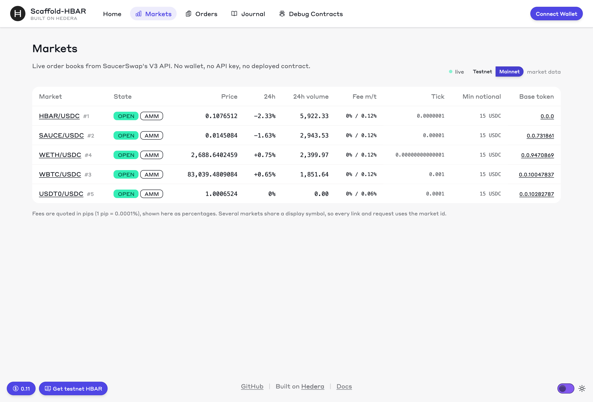
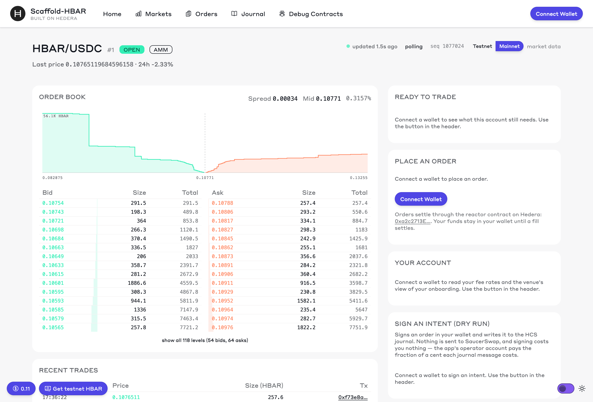
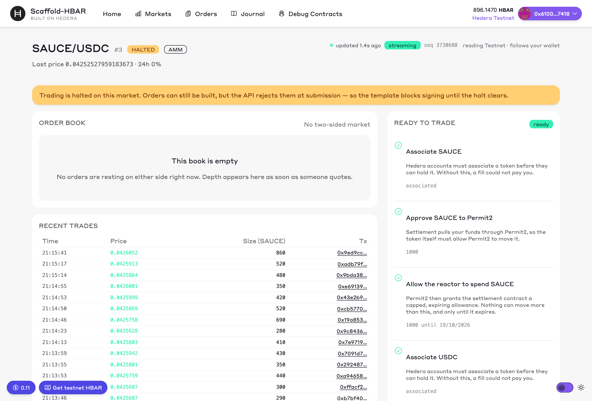
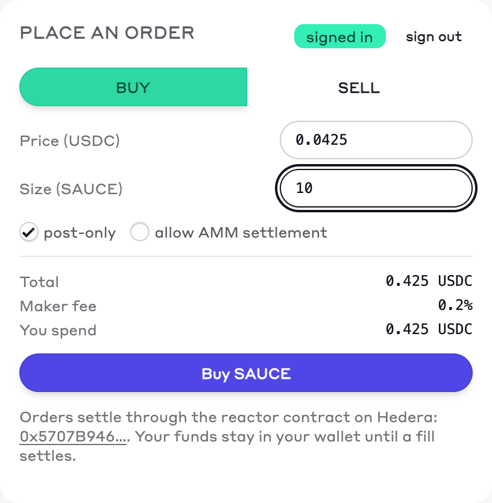
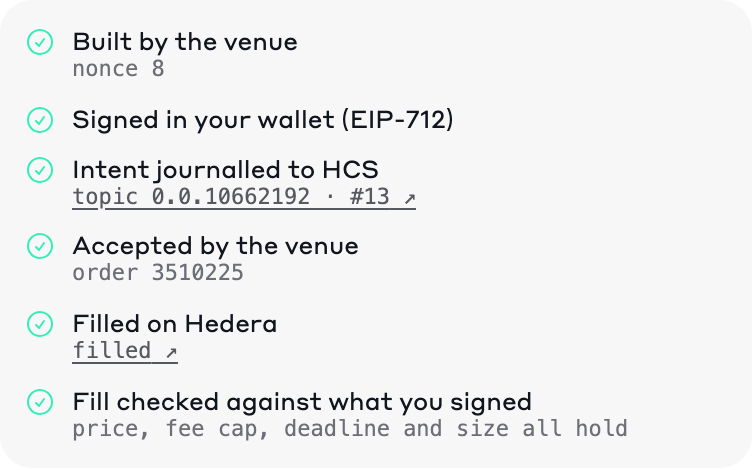
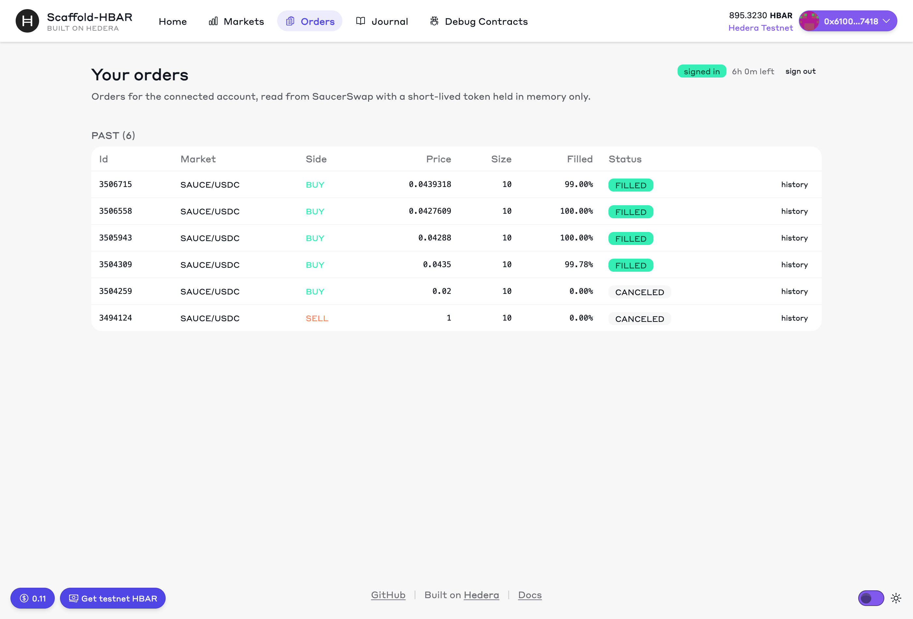
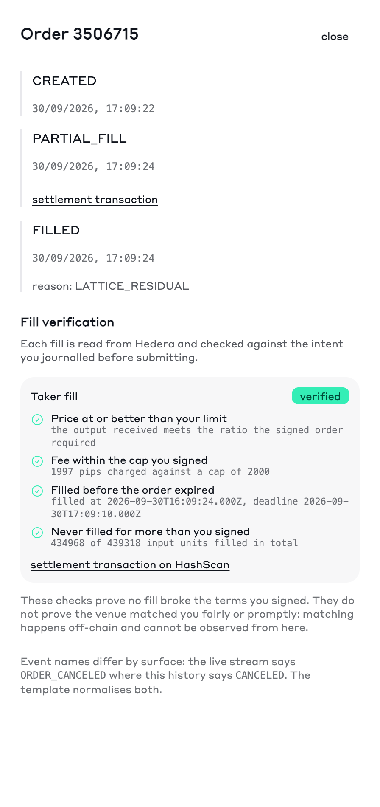
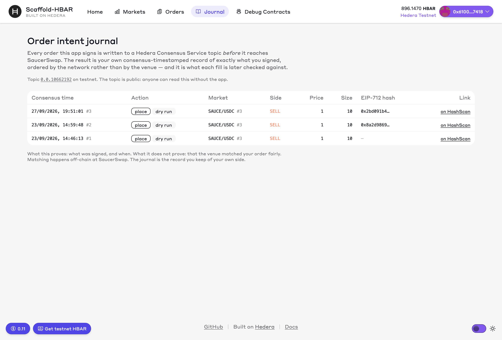
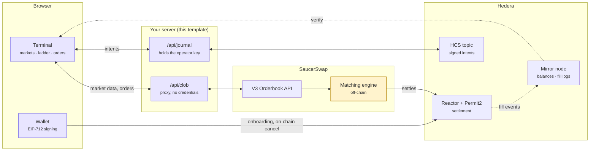
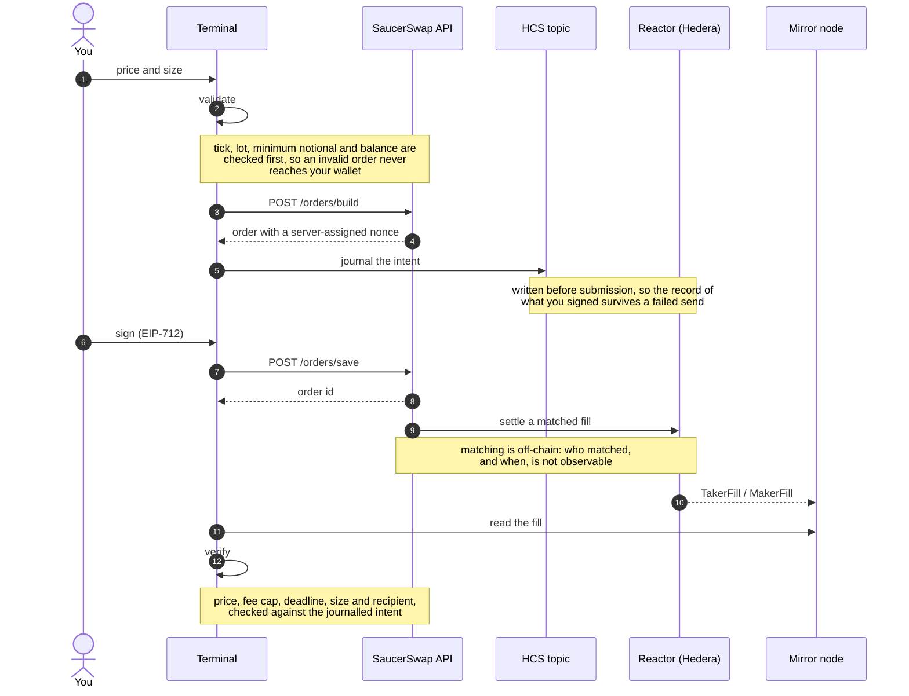

# limit-orders — the reference client for SaucerSwap's V3 order book on Hedera

Add non-custodial limit orders from SaucerSwap's order book to any Hedera app, with every fill verified
on-chain against what you signed.

[](https://github.com/OrderForge/scaffold-hbar-limit-orders/actions/workflows/ci.yaml) [](https://github.com/OrderForge/scaffold-hbar-limit-orders/actions/workflows/fresh-scaffold.yaml) [](https://github.com/OrderForge/scaffold-hbar-limit-orders/actions/workflows/harness.yaml) [](https://github.com/OrderForge/scaffold-hbar-limit-orders/actions/workflows/doctor.yaml) [](https://github.com/OrderForge/scaffold-hbar-limit-orders/actions/workflows/codeql.yaml)

```bash
npm create scaffold-hbar@latest -- --template OrderForge/scaffold-hbar-limit-orders
```

The `--` matters: without it npm keeps `--template` for itself, and you get the default
template instead of this one. `npx create-scaffold-hbar@latest --template OrderForge/scaffold-hbar-limit-orders`
works too.

<p align="center">
  <a href="https://youtu.be/WejBlTjknAE"></a><br />
  <sub>▶ <a href="https://youtu.be/WejBlTjknAE">Watch the 4-minute demo</a>: one command to scaffold, live markets with no keys,
  wallet onboarding, a signed order through every step to a fill checked on-chain, and features switched off
  from the command line.</sub>
</p>

**Nothing to deploy, nothing escrowed.** Orders rest on SaucerSwap's own order book, the one that trades on
mainnet, and your tokens stay in your wallet until a fill settles. The template adds what the venue leaves
to you: onboarding read from the chain, a public record of what you signed, and a check of every fill.

### Proof, one click each

None of these needs a wallet.

| What | Evidence |
| --- | --- |
| An order filled, then verified | Order 3504309, BUY 10 SAUCE with a 0.0435 limit: [settlement](https://hashscan.io/testnet/transaction/0xd329c0b88e4e98f1be541255f3a88e8761979aaf0acdf9b91968b5b8465fac76), filled at 0.0434055 for a fee of 1,999.7 pips under a 2,000 cap. All four fill checks pass |
| Orders placed and cancelled | Orders 3494124 and 3504259 on book 3, `ACTIVE` → `CANCELED` in about a second. With a key, `yarn clob:doctor --place` repeats it on demand |
| The signed-intent journal | [Topic `0.0.10662192`](https://hashscan.io/testnet/topic/0.0.10662192): each order's EIP-712 hash on HCS, written before the order reached the venue |
| Onboarding, on-chain | [SAUCE→Permit2](https://hashscan.io/testnet/transaction/0x490de469a1d0f08a825a80a79c8c6b12a9ca840939ea6f7239831fdffda37083), [Permit2→settlement](https://hashscan.io/testnet/transaction/0x0e9462293d2374b80222f2dba26b6868a538899cb34d5682e5ca49135de2379d), [USDC→Permit2](https://hashscan.io/testnet/transaction/0xdfa33dfdba54534f33d37987224a4ad6d89b9db4f1e1a729c99e2148f031a512), [Permit2→settlement](https://hashscan.io/testnet/transaction/0x488f4b370b19eaf740be8f7293cf35cd06f38bd0ccb4ca3a52f0d815f6d8c994), and native HBAR's [`hbarApprove` through HIP-906](https://hashscan.io/testnet/transaction/0x53182bbafe0737b9ae7014f461ece4caecb987e58843cbcccab923053152d111), sent to the account's own address |
| Checked continuously | [Fresh scaffold](https://github.com/OrderForge/scaffold-hbar-limit-orders/actions/workflows/fresh-scaffold.yaml) on every push: `npm create scaffold-hbar` from GitHub, then lint, tests, build and six routes answering 200. [API doctor](https://github.com/OrderForge/scaffold-hbar-limit-orders/actions/workflows/doctor.yaml) daily: 19 checks that SaucerSwap's API still behaves as the code expects |
| The live demo | [Mainnet and testnet order books](https://scaffold-hbar-limit-orders.vercel.app/markets), read with no wallet |

Behind them: 210 tests, run by [CI](.github/workflows/ci.yaml) on every push, and
[15 places the API differs from its docs](docs/DISCREPANCIES.md), each one handled.

### Hedera services, and what each does here

| Service | Its job in this template |
| --- | --- |
| **Token Service** | A token must be associated with an account before it can be held or settled. The checklist reads that from the mirror node and associates what is missing |
| **Smart contracts** | Approvals to Permit2 and SaucerSwap's settlement contract, which moves funds at each fill. Native HBAR uses an HBAR allowance through HIP-906 |
| **Consensus Service** | The intent journal: every signed order's EIP-712 hash, with a consensus timestamp, recorded before submission |
| **Mirror node** | The source of truth for associations, allowances and settlement logs, so fills are checked against the chain, not the venue's word |
| **SaucerSwap V3 order book** | The venue: market data, sign-in, building, submitting and cancelling orders. [docs/hedera.md](docs/hedera.md) has the full trust boundary |

**Live demo:** [scaffold-hbar-limit-orders.vercel.app](https://scaffold-hbar-limit-orders.vercel.app). It reads
both networks and trades on testnet only. Mainnet is read-only there, and the HCS journal is off, so
[host your own](#hosting-a-public-demo) to try everything.

> **Status:** complete and working — market terminal, live depth over WebSocket, onboarding, wallet
> login, order placement and cancellation, the HCS journal, and on-chain fill verification.
>
> **Disclaimer:** this template is **experimental** and **not audited**. It places orders against a
> third-party venue and defaults to Hedera **testnet**. Read SaucerSwap's
> [Risk Notice](https://docs.saucerswap.finance/legal/orderbook-risk-notice) and
> [Terms](https://docs.saucerswap.finance/legal/terms-of-service) before trading real funds.



<p align="center"><em>Live mainnet markets. No wallet, no API key, no deployed contract.</em></p>

> **New here?** [**Build it yourself**](docs/tutorial.md) walks you from an empty folder to a filled order
> you have verified on-chain, in seven chapters — the first two need no wallet and no keys.

## Contents

1. [Prerequisites](#prerequisites) — what you need to look, and what you need to trade
2. [Run it in 60 seconds](#run-it-in-60-seconds) — no keys, no wallet
3. [What you get](#what-you-get) — and what you still trust the venue for
4. [What you could build with it](#what-you-could-build-with-it) — six starting points
5. [See it working](#see-it-working) — the wallet half, in pictures
6. [How it works](#how-it-works) — architecture, the order path, where each piece lives
7. [Set up the on-chain half](#set-up-the-on-chain-half) — keys, journal topic, test tokens
8. [Configuration](#configuration) — [modes](#modes), networks, environment
9. [Reference](#reference) — commands, layout, wallet setup, units
10. [Documentation](#documentation) — the tutorial, the guides, and which to read first
11. [What this does not do](#what-this-does-not-do)
12. [Common issues](#common-issues) — the errors you are likely to meet, and what they mean
13. [Security](#security) and [Contributing](#contributing) — reporting, and the checks that guard `main`

## Prerequisites

**To run it and read live markets** — no wallet, no keys:

- Node.js ≥ 20.18.3 and Git
- Yarn 3, which the project pins. If `yarn` is missing, run `corepack enable` once (no global install, no
  sudo), or use the copy the project carries: `node .yarn/releases/yarn-3.2.3.cjs <command>`

**To place orders on testnet**, add:

- [MetaMask](https://metamask.io/) with an **ECDSA** account — EIP-712 order signing needs an EVM address,
  which ED25519 accounts do not have. MetaMask is the tested wallet; others that connect through
  WalletConnect may work, but have not been tried.
- Testnet HBAR from the [Hedera Portal faucet](https://portal.hedera.com/faucet). `yarn clob:fund` turns
  some of it into the market's test tokens.
- Optionally, a [WalletConnect project ID](https://cloud.reown.com) in `packages/nextjs/.env`; a shared
  fallback works for local use.

The [tutorial](docs/tutorial.md) walks through all of it.

## Run it in 60 seconds

```bash
yarn install
yarn next:dev
```

Open <http://localhost:3000/markets>. Market discovery, depth, the trade tape and quotes are **public**
endpoints: no wallet, no API key, no deployed contract.

Testnet markets are thin and often halted, so the terminal has a **Testnet / Mainnet** toggle for market
data. Reading mainnet prices moves no funds; wallet actions stay on your wallet's own network.



<p align="center"><em>HBAR/USDC on mainnet: the depth chart over 100+ levels of real depth, the spread, and a
trade tape linked to settlement transactions.</em></p>

> **Why requests go through the template's own `/api/clob` route:** the Orderbook API sends no CORS headers,
> so a browser cannot call it directly however public the endpoint is — it is built for server-side
> clients. The template forwards the request from its own server instead. The proxy holds no credentials. See
> [docs/DISCREPANCIES.md](docs/DISCREPANCIES.md).

## What you get

SaucerSwap runs a central limit order book (V3) on Hedera, separate from its AMM pools. It has a public
HTTP API and **no published client library**. This template is that client, plus a working UI on top of it.

- **Market data** — books, depth, the trade tape and quotes, with each market's trading rules (tick, size
  step, lot, minimum notional) applied correctly.
- **Live depth** — the WebSocket with snapshot-and-diff reconciliation, re-syncing on any gap, falling
  back to polling when it cannot connect. An optional **depth chart** draws the same book as cumulative
  bid and ask curves.
- **Onboarding** — before it can trade, a Hedera account must associate the tokens (HTS), approve them
  to Permit2, and approve the reactor inside Permit2. The template detects each step, does it in one
  click, and re-checks the result against the chain rather than trusting the receipt.
- **Account** — wallet-challenge login, your own fee rates, your orders and their history. The token is
  short-lived and held in memory only: never localStorage, never a cookie, never logged.
- **Orders** — build, sign (EIP-712) and submit; cancel through the API or directly on-chain.
- **Journal** — every signed intent goes to an HCS topic before submission, giving you your own
  consensus-timestamped record of what you signed.
- **Verification** — every fill is verified on-chain against the order you signed: price, fee cap,
  deadline, size and recipient. See [docs/hedera.md](docs/hedera.md).

### What you still trust SaucerSwap for

Matching happens off-chain, and only SaucerSwap's filler can settle your order, so the venue decides the
order in which orders match and whether your order is accepted at all. What the contract does guarantee is
that no fill can break the terms you signed, and that you can cancel on-chain without asking anyone. This
template verifies the second part and is explicit about the first.

## What you could build with it

A limit order is a primitive, not a product. The parts worth reusing are the typed client,
the money handling, the six onboarding steps and the verification — each of these starts
from something already here rather than from the API documentation.

| Idea | What you start from |
| --- | --- |
| **A limit-order button in an app that already swaps.** Offer "set a price instead" next to a market swap, so a user who does not like the current rate leaves an order behind instead of leaving. | `components/clob/OrderEntry.tsx` and `lib/clob/orders.ts` — the whole build → journal → sign → submit path |
| **Laddering or DCA.** Split one large order into a grid of smaller ones across a price range, or buy a fixed amount on a schedule. | The same placement path in a loop; `validateOrder` already enforces the tick, lot and minimum-notional rules each rung has to satisfy |
| **A post-only market maker.** Quote both sides, never cross, and earn the maker fee rather than pay the taker one. | `makerOnly` is a per-order flag, and `lib/clob/format.ts` converts the fee pips honestly; `lib/clob/depthStream.ts` gives a book that is current and knows when it is not |
| **Treasury or DAO exits.** Sell a position at a target price over time, without handing custody to anyone — the allowance the checklist sets is capped and expires. | `lib/hedera/onboarding.ts` for the allowances, `lib/verify/fills.ts` for the record of what actually settled |
| **An agent that trades for you.** An automated signer can commit to an order and leave a consensus-timestamped record of exactly what it committed to, which is a different thing from its own logs. | `lib/journal/` writes the intent before submission; the digest in each record links it to the settlement that follows |
| **Alerting and receipts.** Watch a book for a price or a depth change, or produce a record of intent against settlement for accounting. | `lib/clob/depthStream.ts` for the book, `lib/mirror/` for the chain, `lib/verify/fills.ts` for the comparison |

None of these needs a contract deployed. The venue's contracts are already on Hedera; this
template is the client that talks to them correctly.

## See it working

Connect a wallet and the template follows **its** network, because an approval signed on one chain says
nothing about the other. The readiness checklist is derived from the chain — the mirror node and the
contracts — rather than from the venue's view of your account.



<p align="center"><em>Testnet SAUCE/USDC, signed in: depth switches from polling to the WebSocket, and the
six on-chain onboarding steps are checked against the chain.</em></p>

The order ticket validates before it asks your wallet for anything: an off-tick price, a size
that is not a whole lot, or an order below the minimum notional is named and refused here
rather than rejected by the venue after you have signed it.

<p align="center">
  
</p>

<p align="center"><em>Buy or sell, post-only to guarantee the maker fee, and AMM settlement opt-in
per order. The total and the fee are shown before signing — on a halted market too, where the order
cannot be placed but the arithmetic still answers "what would this cost?".</em></p>

Click **Buy** or **Sell** and the ticket follows the order through its whole life, each step with its
evidence: the venue's nonce, the signature, the journal entry on HCS, the order id, the settlement
transaction, and the checks against what you signed.

<p align="center">
  
</p>

<p align="center"><em>Order 3510225 on testnet, fourteen seconds from click to verified fill. A step that fails
says why; a rejected order still shows its journal receipt, because the intent was recorded first.</em></p>

Signing in exchanges a wallet signature for a short-lived API token, which never leaves memory.



<p align="center"><em>Your orders, read from SaucerSwap with a token held in memory only — real testnet
orders, filled and cancelled.</em></p>

Open a filled order and every fill is checked on-chain against what you signed. The settlement is read
from the mirror node, the fill that belongs to this order is picked out of it by swapper and nonce, and
four things are checked: price, fee cap, deadline and size.

<p align="center">
  
</p>

<p align="center"><em>Order 3506715 on testnet: placed, filled two seconds later, and verified — filled
under the limit, a 1,997-pip fee under a 2,000-pip cap, before the deadline, within the size signed.</em></p>



<p align="center"><em>Each signed intent, on an HCS topic, ordered by consensus rather than by the venue.
The digest is what links an intent to the settlement that follows.</em></p>

These frames are scripted — `yarn clob:shots` re-captures them from the running app — so they cannot
quietly drift from what the code does.

## How it works


```mermaid
flowchart LR
    subgraph browser["Browser"]
        direction TB
        UI["Terminal<br/><small>markets · ladder · orders</small>"]
        WALLET["Wallet<br/><small>EIP-712 signing</small>"]
    end

    subgraph server["Your server (this template)"]
        direction TB
        PROXY["/api/clob<br/><small>proxy, no credentials</small>"]
        JOURNAL["/api/journal<br/><small>holds the operator key</small>"]
    end

    subgraph venue["SaucerSwap"]
        direction TB
        API["V3 Orderbook API"]
        MATCH["Matching engine<br/><small>off-chain</small>"]
    end

    subgraph hedera["Hedera"]
        direction TB
        REACTOR["Reactor + Permit2<br/><small>settlement</small>"]
        TOPIC["HCS topic<br/><small>signed intents</small>"]
        MIRROR["Mirror node<br/><small>balances · fill logs</small>"]
    end

    UI <-->|"market data, orders"| PROXY
    PROXY <--> API
    UI <-->|"intents"| JOURNAL
    JOURNAL <--> TOPIC
    API --> MATCH
    MATCH -->|"settles"| REACTOR
    WALLET -->|"onboarding, on-chain cancel"| REACTOR
    REACTOR -.->|"fill events"| MIRROR
    MIRROR -.->|"verify"| UI

    classDef untrusted fill:#fff3cd,stroke:#b8860b,stroke-width:2px
    classDef ours fill:#e8e5ff,stroke:#6b5ce7
    class MATCH untrusted
    class UI,WALLET,PROXY,JOURNAL ours
```

The highlighted box is the one part nobody can verify: matching happens off-chain, and only
SaucerSwap's filler can settle an order. Everything else is in your browser, on your own
server, or on Hedera where anyone can check it.

<details>
<summary><strong>Placing an order, end to end</strong> — the full sequence</summary>


```mermaid
sequenceDiagram
    autonumber
    actor You
    participant App as Terminal
    participant API as SaucerSwap API
    participant HCS as HCS topic
    participant R as Reactor (Hedera)
    participant M as Mirror node

    You->>App: price and size
    App->>App: validate
    Note over App,API: tick, lot, minimum notional and balance are<br/>checked first, so an invalid order never<br/>reaches your wallet
    App->>API: POST /orders/build
    API-->>App: order with a server-assigned nonce
    App->>HCS: journal the intent
    Note over HCS,R: written before submission, so the record of<br/>what you signed survives a failed send
    You->>App: sign (EIP-712)
    App->>API: POST /orders/save
    API-->>App: order id
    API->>R: settle a matched fill
    Note over API,R: matching is off-chain: who matched,<br/>and when, is not observable
    R-->>M: TakerFill / MakerFill
    App->>M: read the fill
    App->>App: verify
    Note over App,API: price, fee cap, deadline, size and recipient,<br/>checked against the journalled intent
```

See [docs/hedera.md](docs/hedera.md#the-trust-boundary) for what each guarantee rests on.

</details>

| Piece | Where |
| --- | --- |
| Typed API client | `packages/nextjs/lib/clob/` |
| Same-origin API proxy | `packages/nextjs/app/api/clob/[network]/[...path]` |
| Mirror node reads | `packages/nextjs/lib/mirror/` |
| Wallet login | `packages/nextjs/lib/clob/auth.ts` — token in memory only |
| Onboarding checks | `packages/nextjs/lib/hedera/onboarding.ts` |
| HCS journal | `packages/nextjs/lib/journal/` + `app/api/journal` (the only place holding a Hedera key) |
| Order build/sign/cancel | `packages/nextjs/lib/clob/orders.ts` |
| Live depth stream | `packages/nextjs/lib/clob/depthStream.ts` — buffer, snapshot, reconcile, re-sync on a gap |
| Depth chart (optional) | `packages/nextjs/components/clob/DepthChart.tsx` + `lib/clob/depthChart.ts`; switched in `features.config.ts` |
| Fill verification | `packages/nextjs/lib/verify/fills.ts` |
| EIP-712 digest parity | `packages/hardhat/contracts/OrderDigest.sol` — the order type written a second time, in Solidity, so a transcription error fails a test |
| Scripts | `packages/hardhat/scripts/` — `clob:bootstrap`, `clob:fund`, `clob:status`, `clob:doctor` |

## Set up the on-chain half

```bash
yarn hardhat:account:generate        # or bring your own ECDSA key
# fund it at https://portal.hedera.com/faucet, then:
cp packages/hardhat/.env.example packages/hardhat/.env    # add HEDERA_OPERATOR_ID / _KEY
yarn clob:bootstrap                  # creates the HCS journal topic, prints its id
# copy the printed JOURNAL_TOPIC_ID lines into packages/nextjs/.env
yarn clob:fund                       # swaps a little HBAR into the market's two tokens
yarn clob:status                     # verifies all of the above, says what is left
```

Then open a market page: the **ready-to-trade** checklist shows the six on-chain steps, each with a
HashScan link, and **sign an intent (dry run)** signs an order in your wallet and writes it to the
journal without sending it anywhere.

## Configuration

### Modes

The template reads market data from either network, and which one it uses is decided by
configuration alone — no code changes.

| Mode | How | When to use it |
| --- | --- | --- |
| **Testnet-live** (default) | `NEXT_PUBLIC_CLOB_NETWORK=testnet` | Normal development. Trade with faucet HBAR and test tokens from `yarn clob:fund`. |
| **Mainnet-read** | `NEXT_PUBLIC_CLOB_NETWORK=mainnet`, or the toggle on the markets page | When testnet markets are closed or halted — which is common. Reading mainnet prices moves no funds. |
| **Custom endpoint** | `NEXT_PUBLIC_CLOB_API_URL=<your proxy>` | Pointing at a proxy, a mirror of the API, or a local fake for tests. |

The honest trade-off with mainnet-read: **market data and trading can be on different
networks**, which is confusing enough to be dangerous. So the template does not allow it
silently — once a wallet is connected the viewed network follows the wallet, and
deliberately reading the other network marks everything wallet-related read-only until the
two agree.

Testnet liquidity is thin. At the time of writing, testnet has one open market (book 3,
SAUCE/USDC). That is why the mainnet-read mode exists, and why the template renders halted
and empty books as first-class states rather than errors.

### When testnet halts: how we got it back

Book 3 settles through a SaucerSwap settler account, `0.0.6628041`, which pays for every settlement in
HBAR. When it runs dry, the market halts, and the API only says that it is halted, not why.

That happened while this template was being built. Book 3 was halted from 2026-09-19, which blocked
every live order test. On 2026-09-30 we asked in SaucerSwap's Discord, and the team explained that the
settler had run out of HBAR and topped it up. The market reopened that afternoon, and the first real fill
behind this template's verification settled minutes later. By that evening the settler had spent its
1,000 HBAR and the market halted again. A second report got it refilled.

So if book 3 shows **HALTED**, the fix is a message, not a code change. Post in SaucerSwap's Discord,
name the market (book 3, SAUCE/USDC on testnet) and the settler (`0.0.6628041`), and ask whether it needs
HBAR. Read mainnet in the meantime. Thanks to the SaucerSwap team for helping both times.

### Optional features

Some parts of the terminal are optional, and each one can be switched off or deleted with a
command rather than by hunting through the code:

```bash
yarn clob:feature list                 # what exists, and whether it is on
yarn clob:feature off depth-chart      # hide it — a running dev server updates without a reload
yarn clob:feature on depth-chart
yarn clob:feature remove depth-chart   # delete its files and every reference to them
```

The switches live in `packages/nextjs/features.config.ts`, next to `scaffold.config.ts`. `remove`
previews what it will delete and asks for `--yes`; afterwards the project still type-checks, lints and
builds, with no dead code left behind. It finds the feature's code by marker comments
(`{/* feature:depth-chart */}` … `{/* /feature:depth-chart */}`), so a new optional feature joins by
adding an entry to `scripts/feature.mjs` and marking its code the same way.

| Feature | What it is |
| --- | --- |
| `depth-chart` | Cumulative bid/ask curve above the ladder, drawn from the live depth. Plain SVG, no chart library. |

There is no price chart, on purpose: the Orderbook API has no candle or price-history endpoint, and
trades are capped at the latest 100 — about 16 hours on the busiest mainnet market. A chart that
implied more history than that would be misleading.

### Hosting a public demo

`packages/nextjs` deploys to Vercel as it is: run `vercel` from `packages/nextjs`, or import the repo
with `packages/nextjs` as the root directory. A URL anyone can open needs four settings that a local
copy does not:

| Setting | Why |
| --- | --- |
| `NEXT_PUBLIC_READ_ONLY_NETWORKS=mainnet` | Visitors can read mainnet but cannot sign real-money orders through your site |
| `NEXT_PUBLIC_ENABLE_BURNER_WALLET=false` | A burner keeps its key in the visitor's browser storage |
| `NEXT_PUBLIC_WALLET_CONNECT_PROJECT_ID` | Your own, from [cloud.reown.com](https://cloud.reown.com), with your domain added to it. The built-in fallback is shared by every scaffold project, so wallets cannot verify your site: HashPack flagged our demo as malicious while it used the fallback |
| no `HEDERA_OPERATOR_KEY` | Otherwise every visitor's journal entry is paid from your account. The journal step then reports that it is not configured, and orders still go through |

<details>
<summary><strong>Environment variables</strong></summary>

Copy `packages/hardhat/.env.example` → `packages/hardhat/.env` and `packages/nextjs/.env.example` →
`packages/nextjs/.env`. No secret is needed for market data.

| Variable | Used by | Purpose |
| --- | --- | --- |
| `NEXT_PUBLIC_CLOB_NETWORK` | frontend | `testnet` (default) or `mainnet` |
| `NEXT_PUBLIC_CLOB_API_URL` | frontend | Override the Orderbook API base, e.g. for a proxy |
| `NEXT_PUBLIC_MIRROR_URL` | frontend | Hedera mirror node |
| `NEXT_PUBLIC_DEFAULT_ORDERBOOK_ID` | scripts | The market `yarn clob:fund` buys test tokens for (default `3`) |
| `NEXT_PUBLIC_WALLET_CONNECT_PROJECT_ID` | frontend | WalletConnect project id |
| `NEXT_PUBLIC_JOURNAL_TOPIC_ID` | frontend | HCS topic the journal reads |
| `NEXT_PUBLIC_ENABLE_BURNER_WALLET` | frontend | `false` turns off the built-in burner wallet, which otherwise connects by itself |
| `NEXT_PUBLIC_READ_ONLY_NETWORKS` | frontend | Networks this deployment only reads, e.g. `mainnet`; every wallet action is refused on them |
| `JOURNAL_TOPIC_ID` | server | HCS topic the journal writes to |
| `HEDERA_OPERATOR_ID` / `HEDERA_OPERATOR_KEY` | server | Pays for journal messages. **Never** prefix the key with `NEXT_PUBLIC_` |
| `DEPLOYER_PRIVATE_KEY` | hardhat | Only for the on-chain scripts; never committed |

</details>

## Reference

### Commands

```bash
yarn next:dev                   # frontend, hot reload
yarn next:build
yarn next:check-types
yarn hardhat:compile
yarn hardhat:test
yarn test:clob                  # unit tests, offline against captured fixtures
yarn lint
yarn format

yarn clob:bootstrap             # create the HCS journal topic (idempotent)
yarn clob:status                # check API, contracts, operator and journal
yarn clob:fund --hbar 20        # swap HBAR into a market's tokens
yarn clob:doctor                # check the live API still matches what this was built against
yarn clob:doctor --place        # also place a resting testnet order and cancel it (needs a key)
yarn clob:demo                  # record a walkthrough of the running app
yarn clob:shots                 # re-capture the README screenshots
yarn clob:feature list          # optional features: list / on / off / remove
yarn smoke                      # browser smoke test against a running build
yarn hedera-harness validate    # the full harness: commands, static checks, browser
yarn lint:wording               # fail the build if the docs claim more than the design backs
```

<details>
<summary><strong>Wallet setup</strong> — only needed for on-chain steps</summary>

**MetaMask — Hedera Testnet**

| Field | Value |
| --- | --- |
| Network Name | Hedera Testnet |
| RPC URL | `https://testnet.hashio.io/api` |
| Chain ID | `296` |
| Currency Symbol | HBAR |
| Explorer | `https://hashscan.io/testnet` |

Fund it from the [Hedera Portal faucet](https://portal.hedera.com/faucet). EIP-712 order signing needs an
**ECDSA** account, since ED25519 accounts have no EVM address.

</details>

<details>
<summary><strong>Hedera value handling</strong> — three units, one converter</summary>

| Context | Unit | 1 HBAR equals |
| --- | --- | --- |
| JSON-RPC (sending a tx) | wei | 10^18 |
| Contract `msg.value` | tinybars | 10^8 |
| Conversion | 1 tinybar = 10^10 wei | |

`packages/nextjs/utils/hedera/valueConversion.ts` is the only place that converts.

</details>

<details>
<summary><strong>Project structure</strong></summary>

```
packages/hardhat/
  scripts/       account tooling, generateTsAbis.ts, and clob:bootstrap/status/fund/doctor/shots
  deploy/        hardhat-deploy scripts
packages/nextjs/
  app/           markets, market/[id], orders, journal, debug, and the API routes
  app/api/clob/  same-origin proxy for the Orderbook API (it sends no CORS headers)
  app/api/journal/  the only place holding a Hedera key; writes one topic message
  components/clob/  terminal, checklist, order entry, fill checks
  hooks/clob/    network, auth, market data, onboarding, placement
  lib/clob/      config, types, http, format (money), depth, depthStream, orders, auth
  lib/hedera/    the six onboarding steps, derived from chain reads
  lib/journal/   HCS order-intent records
  lib/verify/    fill verification against the signed order
  test/          207 unit tests, offline against fixtures captured from the live API
docs/            microstructure, integration, hedera, discrepancies
.harness/        harness spec, increment PRDs, validators
```

</details>

<details>
<summary><strong>Harness</strong> — the Hedera Harness recipe and its gates</summary>

The [Hedera Harness](https://www.npmjs.com/package/hedera-harness) recipe lives in `.harness/`: the spec,
five increment PRDs, the static and command validators, a browser smoke test, and an acceptance contract.
The harness is a dev dependency, so `yarn install` brings it in.

```bash
yarn hedera-harness validate      # all three tiers
```

On a fresh clone all seven commands pass (install, wording, lint, compile, both test suites, build), the
static validator and secret scan are clean, and the browser gate passes 6/6 routes with no console errors.
It serves the production build the command tier has just made, rather than a dev server that would spend
its first minute compiling. Playwright uses its own browser where it can install one and system Chrome
where it cannot — macOS 13, for one.

Once you have set up the on-chain half, the secret scan fails on purpose: it refuses to pass while
`packages/nextjs/.env`, `packages/hardhat/.env` or `.clob.json` exist, even though git ignores them, so a
key can never ship with the template. Validate a clean checkout, or move those files aside first.

The harness gate checks that each route loads, renders and logs no errors; it does not read the text each
route promises. `yarn smoke` checks that too, against a running build:

```bash
yarn next:build && yarn workspace @sh/nextjs serve   # one terminal
yarn smoke                                           # another
```

Both assert on structure rather than market data. An earlier version looked for bid and ask rows, which
would have failed the moment testnet halted — testing the venue rather than the template.

</details>

## Documentation

| Guide | What is in it |
| --- | --- |
| [docs/tutorial.md](docs/tutorial.md) | **Build it yourself**, in seven chapters: scaffold, read a market, fund an account, onboard a wallet, journal to HCS, place and cancel an order, then get a fill and verify it. Each chapter has the commands, what you should see, and the file to read. **Start here.** |
| [docs/microstructure.md](docs/microstructure.md) | Tick and lot grids, the minimum-notional units trap, pips vs basis points, crossed books, AMM routing, and how depth is reconciled. Read this after the tutorial. |
| [docs/integration.md](docs/integration.md) | The endpoint map as the API really behaves, both auth schemes, the order-placing details that each cost an order if missed, and what to copy into your own client. |
| [docs/hedera.md](docs/hedera.md) | The trust boundary, each Hedera service and its job, why an address is not yet an account, and what fill verification does and does not prove. |
| [docs/DISCREPANCIES.md](docs/DISCREPANCIES.md) | Fifteen places where the live API differs from its own documentation, each handled in code — including how native HBAR is traded and what a settlement transaction really contains. |
| [AGENTS.md](AGENTS.md) | For coding agents: key paths, the money rules, and the mistakes that are easy to make here. |

## What this does not do

- **No AMM swaps, liquidity provision, farming or staking.** This is the order book only. `clob:fund`
  uses the V1 router to buy test tokens, and that is the extent of it.
- **No trading strategy, portfolio or P&L.** It places the order you ask for.
- **No deployed contracts of its own.** It integrates SaucerSwap's. The one contract here,
  `OrderDigest.sol`, is a test fixture: it recomputes the EIP-712 digest in Solidity so a
  drift between the client's type and the real one fails `yarn hardhat:test`.
- **No live depth without signing in.** Both SaucerSwap WebSockets require a JWT, so a keyless visitor
  cannot stream. Depth polls every 1.5 seconds instead, the UI says which it is using, and signing in
  switches to the stream.
- **No proof that the venue treated you fairly.** Matching is off-chain. The template verifies settlement
  against your signed order and is explicit that ordering, acceptance and latency are not observable.
- **Cancellation is not instant.** A `202` is an acknowledgement; the UI says "cancel requested" until the
  order's history confirms it, because an order that is still live can still fill.
- **Keyless market data is a rollout, not a guarantee.** If a network has not had it yet, public reads
  answer `401` and the template says so instead of showing a login prompt nobody can satisfy.

## Common issues

Each of these has happened while building this template. The message you see is in bold.

**`npm create` scaffolds the default template, not this one.** npm keeps flags before `--` for itself, so
`--template` never reaches the scaffolder. Use `npm create scaffold-hbar@latest -- --template OrderForge/scaffold-hbar-limit-orders`.

**"This address has no account on testnet yet."** On Hedera an address becomes an account when it first
receives HBAR, and not before. Fund it from the [faucet](https://portal.hedera.com/faucet) and the six
steps appear. The built-in burner wallet always starts in this state.

**"This market is halted and is not accepting new orders."** The venue has paused the market — on
testnet, usually because its settlement service ran out of HBAR. The order is refused before you sign;
if you sign anyway, `/orders/build` succeeds and `/orders/save` answers `400`. Read mainnet in the
meantime, and ask in SaucerSwap's Discord: see [When testnet halts](#when-testnet-halts-how-we-got-it-back).

**"Price must be a multiple of the tick size…" / "Size must be a whole number of lots…"** Every market
has a price grid and a size grid, and the ticket names the nearest allowed value. Lot and minimum
order value are in the token's smallest units, not decimals — see
[microstructure.md](docs/microstructure.md#minimum-notional-the-units-trap).

**An allowance read fails with `0x494e5641…`.** That is ASCII `INVA`, the start of `INVALID_ACCOUNT_ID`:
the owner address has no Hedera account yet. Fund it first. The checklist does not ask the chain until
the mirror node knows the account.

**The order stays at "Filled on Hedera", waiting.** A limit order only fills when someone trades at your
price. Post-only orders never take liquidity; untick it, or price at the best ask, to fill straight away.

**"Cancel requested", but the order is still active.** A `202` from the venue is an acknowledgement, not
a cancellation. The row changes to `CANCELED` once the order's history confirms it, usually within
seconds; until then it can still fill.

**HashPack says "Only ECDSA accounts are able to use this dapp".** Orders are EIP-712 signatures and
the onboarding steps are EVM calls, so the account must be ECDSA. HashPack creates ED25519 accounts by
default: switch to, or import, an ECDSA account.

**A wallet warns that the site is malicious or unverified.** You are probably on the shared
WalletConnect project ID. Create your own at [cloud.reown.com](https://cloud.reown.com), add your domain,
and set `NEXT_PUBLIC_WALLET_CONNECT_PROJECT_ID`.

**Fill verification says "check failed".** Read which check. Before trusting it, make sure you are
signed in as the account that placed the order: fills are matched to an order by swapper and nonce.

**CORS errors with the hashio.io RPC.** Set `NEXT_PUBLIC_HEDERA_TESTNET_RPC_URL` in `packages/nextjs/.env`
to a CORS-enabled endpoint (for example [Arkhia](https://arkhia.io/)), or rely on wallet-connected
operations, since wallets handle RPC internally.

**The journal page is empty.** A topic id exists on one network only. If you are reading a different
network than the topic was created on, the page says so — set `NEXT_PUBLIC_JOURNAL_NETWORK` to match.

**`next build` fails with odd missing-chunk errors.** A dev server is still running and sharing `.next`.
Stop it before building.

**The deployer shows an EVM address, not a Hedera account id.** `yarn hardhat:account:generate` prints the
`0x…` form. Both that and `0.0.xxxxx` work with the [faucet](https://portal.hedera.com/faucet).

## Security

This template is experimental and not audited. [SECURITY.md](SECURITY.md) explains where every key lives,
how allowances are capped and when they expire, and what a public deployment needs. To report a
vulnerability, use **Security → Report a vulnerability** on this repository, not a public issue.

## Contributing

Issues and pull requests are welcome. [CONTRIBUTING.md](CONTRIBUTING.md) covers setup, the checks CI runs,
the money rules review holds you to, and what to do when the API changes. Five workflows guard `main`:

| Workflow | What it proves |
| --- | --- |
| [CI](.github/workflows/ci.yaml) | Lint, types, both test suites and the production build pass, and no secret is tracked |
| [Fresh scaffold](.github/workflows/fresh-scaffold.yaml) | `npm create scaffold-hbar` from GitHub produces a project that lints, tests, builds and serves its core routes |
| [Hedera Harness](.github/workflows/harness.yaml) | The full harness recipe passes, including the browser gate |
| [API doctor](.github/workflows/doctor.yaml) | Daily: SaucerSwap's live API still behaves the way the template expects |
| [CodeQL](.github/workflows/codeql.yaml) | GitHub's code scanning finds no new problem |

## Links

- [SaucerSwap V3 Orderbook API](https://docs.saucerswap.finance/api-reference/orderbook/overview)
- [Hedera documentation](https://docs.hedera.com/)
- [HashScan explorer](https://hashscan.io/testnet)
- [Hedera Portal faucet](https://portal.hedera.com/faucet)

## Licence

MIT. See [LICENSE](LICENSE).
